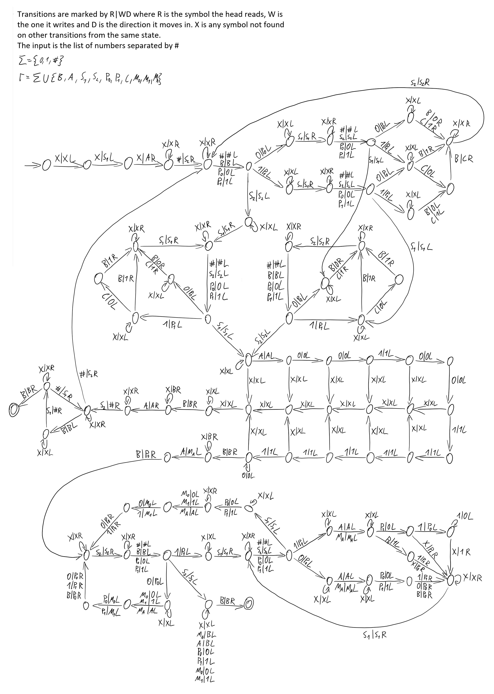

# Advent Of Code 2020, Day 1, Turing Machine

<blockquote class="twitter-tweet">
I know I&#39;m late to the party, but here&#39;s my solution for advent of code day 1! Not really sure what to think of these newfangled &quot;programming languages&quot; so I made it as a simple Turing machine.<a href="https://t.co/Rn68brRcSL">https://t.co/Rn68brRcSL</a> horrible implementation here in case you want to run it <a href="https://t.co/btKVVCiS0O">pic.twitter.com/btKVVCiS0O</a>
&mdash; Imogen (@ImogenBits) <a href="https://twitter.com/ImogenBits/status/1340855966733103106?ref_src=twsrc%5Etfw">December 21, 2020</a></blockquote>  

